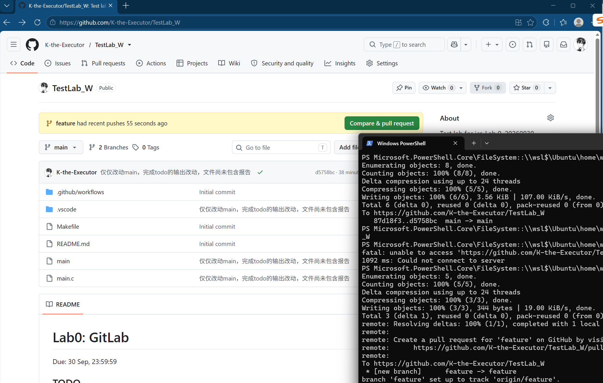
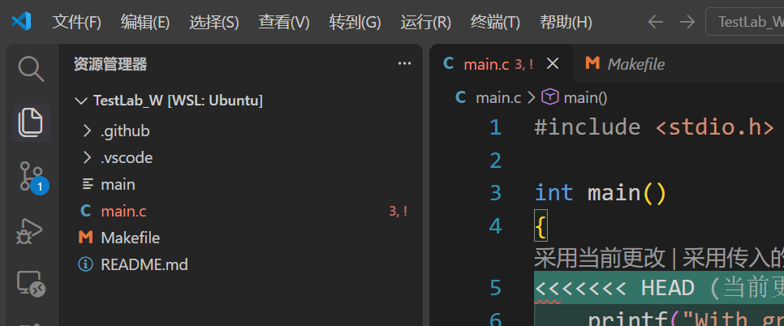
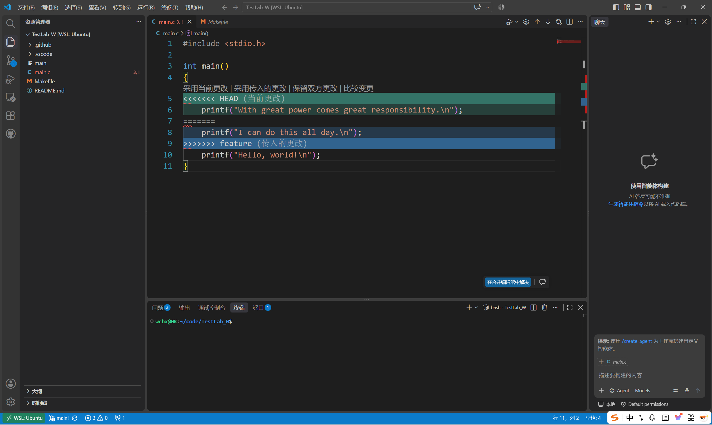
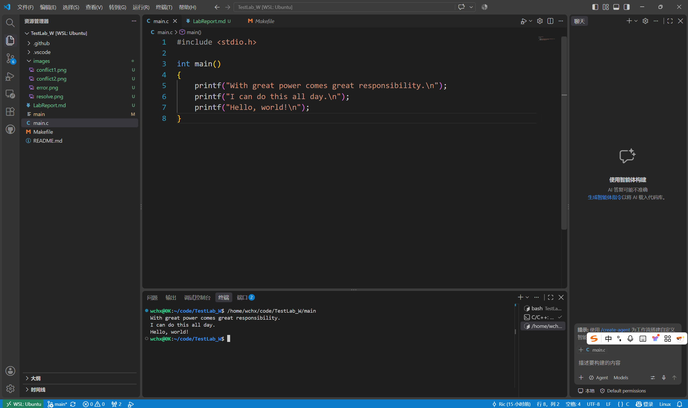
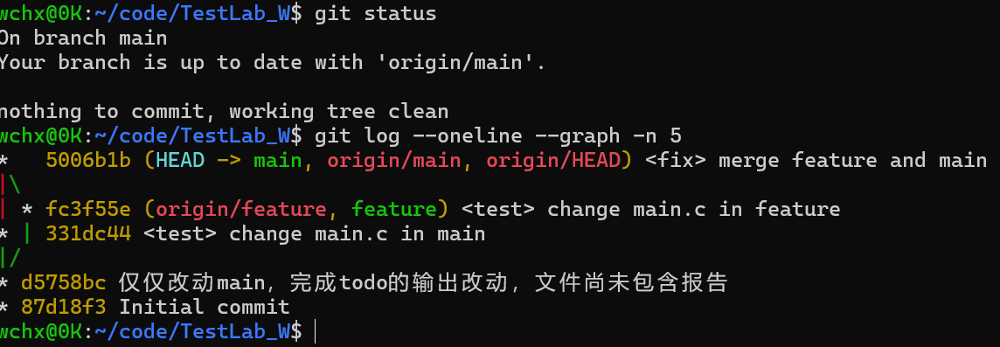
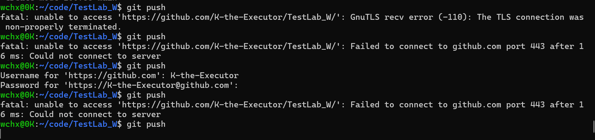

# ics_Lab0报告
姓名：王晨昕 
学号：25300120071
日期：20260930

## 一、 文档中问答题

### 1.1 你之前有过多人协同开发的经历吗？如果有，你们是使用什么方式分工协作的？
**答：**  
    我有过多人开发的经历。
    在大一的时候我尝试参加卓越杯校赛，一个关注儿童线下玩伴缺失问题的项目，我去了里面负责技术的组（也就只有3人）。程序大概是选择兴趣爱好→匹配附近爱好相似的同龄人→发起线下共同游玩的申请，所以要做一个家长端一个儿童端，主要写双方的绑定（活动申请认证通过拒绝）加上一个兴趣匹配算法。我们三人各自在独立分支上开发，一个人负责总框架（最终他来merge和调整），一个负责后端开发，一个做前端。虽说项目并不复杂，也没有得到奖项，但这是我第一次用GitHub和别人协作，也是我第一次好好研究git的使用，收获了很多。在项目里，我主要负责做前端，用dart去做ui（专门要做适配儿童的卡通ui），找素材，然后做些页面优化的工作。在过程中由于后端的队员实在进度太快，十分痛苦，养成了每次写代码之前先看看有没有东西要pull的习惯（和好好写commit甚至写个work.md的习惯）。那一个月忙碌且辛苦，可最后看到成品还是很开心，痛苦的同时深刻意识到git和github简直是太伟大了，倘若没有这项发明我们三人估计已经结下梁子发誓永生永世不相见。

### 1.2 思考一下，Git 为什么要设计“暂存-提交”两个步骤？
**答：**  
    暂存-提交两个步骤的设置可以对项目代码实现更精细的控制（提交更独立），方便排查错误和后续操作。
    在实际开发中，工作区很可能包含多个不相关的修改（例如前端更改ui颜色与按钮图像和后端页面跳转逻辑几乎没有关系）。暂存区允许开发者挑选部分文件甚至部分代码块进行暂存，可以很大程度上避免将未完成的测试代码和未完成的片段或者无关片段混入正式提交中。
    其次，这有助于保持提交记录的原子性。暂存区给commit提供了一个缓冲和预览的机会，让开发者在正式提交前能充分检查修改，确保每次提交历史清晰可溯源，方便日后排查 bug 或进行版本回滚。同时它在正式提交前可随时撤销或补充暂存内容，能防止误操作造成更大影响，也起到防错作用。

### 1.3 git branch 和 git branch -a 的区别是什么？查阅资料并回答。
**答：**  
    git branch本身用于列出本地仓库中所有的本地分支。当前所在的分支名称前会有一个星号 * 作为标记。
    而git branch -a 命令中的 a 是 all 的缩写，用于列出所有分支，包括本地分支和远程跟踪分支。同时，当前所在的本地分支名称前也会有一个星号 * 作为标记。（只要远程的用-r）

## 二、 网页阅读

### 2.1 
**所选网页：** Commit Message 规范: (https://www.ruanyifeng.com/blog/2016/01/commit_message_change_log.html)
**内容概括：**  
    文章是Commit message和Change log 编写指南，介绍了系统化的Angular规范，说明了在该规范下的格式和优点作用（例如只看行首，就知道某次 commit 的目的），介绍了撰写合格 Commit message 的工具Commitizen和检查 Node 项目的 Commit message 是否符合格式的validate-commit-msg以及他们的用法，并且教导了符合规范的情况下如何脚本自动生成Change log。

### 2.2 
**所选网页：** Git Flow 分支控制：（https://notes.vectania.com/article-git-gif-flow）
**内容概括：**  
    文章介绍了 Gitflow 分支管理规范。介绍且举例说明了Gitflow 的五个关键分支及其作用以及他们之间的互动关系和意义，版本号规范和其中每个数字的作用，gitflow工作流程和分支命名建议。

### 2.3 谈谈为什么要学习 Git 
    Git本质上是一个控制软件，极大地提升了管理效率，让能用变成了好用，并且在项目规模越来越大的今天不可或缺，甚至可以说，在软件开发与团队协作的情况下，Git 比起工具更像是基石。
    Git 对个人开发极其有用。独立开发时，人们常常有代码改错或需要回退版本的需求。Git 让每一次提交都成为一个可追溯的节点。通过分支管理，我们可以随时拉出独立的分支进行尝试而完全不会影响主干代码的稳定性，极大地提升了开发的安全与灵活。
    其次，Git 几乎是团队开发的基础。 在多人协作中，倘若没有Git，一切将会是灾难，如果必须要用互相发送压缩包等方式，这极易导致代码覆盖和版本混乱，效率低下且花费过多精力查找而并非开发。git让并行开发成为可能，它让复杂项目的协同开发变得井然有序。甚至可以说，当遇到合并冲突时，解决冲突的过程也是团队沟通、确认代码逻辑的好机会。
    此外，学习 git 有助于养成良好的工程规范，掌握git也是通往开源世界与职业发展的必经门槛。不论是让代码历史清晰可读的commit规范，还是是github上的开源贡献，都培养了我们严谨的编程习惯，提升了项目的效率和可维护性，也给社区做出了更多的贡献。
    总而言之，在软件规模日益庞大的今天，掌握 Git 是每位开发者不可或缺的基本功，也是专业度的体现，也意味着你能更从容地融入现代软件工业的协作体系。学习 Git，比起掌握一项技能，更像是培养工程思维与融入团队的必经之路。

## 三、实验步骤（包括冲突展示）

### 3.1下载wsl，Ubuntu，配置对应的用户名和密码，换源
正如文件所说在cmd里面一步一步照猫画虎焦头烂额地完成了，甚至忘了一回密码又重新改。换源之后提示说有更新可以下载，虽然文档没说但是手快下载了，希望不会出任何问题（目前还没有）。
Watt Toolkit也下载了，但是似乎作用不大，遂没有用。

### 3.2 配置wsl环境，上github克隆仓库到本地
Ubuntu自己带了git不用重新下，Windows的vs下了wsl拓展，去wsl里面给vs下了server和一些别的拓展以及编译器啥的（sudo apt install build-essential gdb -y），给wsl配了公钥到github，都弄好了之后去克隆了一份仓库到本地

### 3.3 完成 main.c 的 TODO 并 commit
搞到现在于是printf了一句哈姆雷特最有名的台词。之后就是标准commit流程。（add .和 commit -m和pull）

### 3.4 新建 feature 分支与修改提交
直接去wsl打了个git checkout -b feature，然后说了一句美队的台词。I can do this all day. 同样pull上去。
这张图能看见两个commit，所以选了这张
  

### 4.2 切回 main 分支修改提交
git checkout main，之后说了一句能力越大责任越大，pull上去

### 4.3 合并与冲突发生
git merge feature 之后跳出

  

并且vs中也体现了冲突
  

### 4.4 解决冲突与提交
直接删除 <<<<<<<、=======、>>>>>>> 这三行标记，并根据需要合并或保留所需代码
选择完毕后，保存文件。
  

之后再在main上pull，结束了！
  

## 四、建议
1.如果后续有可能的话加入一点虚拟机找文件的说明？很惭愧我现在找项目还是命令符敲出来的文件管理器一直找不到（每次找都要问ds）
2.对Watt Toolkit做更多说明，像我启动它加速github之后wsl会自动拦截我所有提的pr（下图展示的是16毫秒就阻止了我完全不是网络问题），我后面是去Windows的powershell才提上去，似乎是需要自己配代理（而并非自动配好：-（ ）
  
3.或者可以稍微说一下虚拟机和Windows的区别？还有下载什么拓展能讲解一下就太好了，实际上我按照外边的逻辑做了很多事情其实有绕弯路的，一开始手自动就clone到d盘了做一半发现事情不对。总之谢谢助教老师也谢谢ds了（终于做完了！！）
4.如果截图看不见我也传了image！！！！